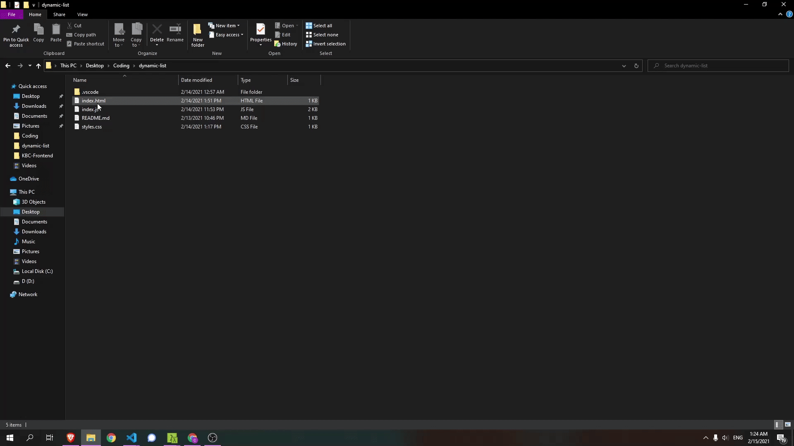

# dynamic-list

A small vanilla-JS app that keeps an editable list of tags entirely in the URL,
so any list can be shared or bookmarked as a link. Responsive, no dependencies.

## Features

- Add a tag through the input field.
- Remove a tag by clicking it.
- Edit the list straight from the URL: everything after `#tags=` is a
  comma-separated list, so sharing the link shares the list.
- Fully client-side and responsive.

## How it works

The list's state lives in the URL hash (`index.html#tags=a,b,c`), not in a
variable. Submitting the form appends a value to the hash, and clicking a list
item splices it out. A `hashchange` listener re-renders the `<ul>` from the hash
on every change, so the URL is always the single source of truth.

## Run it

1. `git clone https://github.com/Zabzuki/dynamic-list.git`
2. Open `index.html` in a browser (right-click → open with Google Chrome).
3. Ready to use.

## Technologies

- JavaScript
- HTML5
- CSS

## License

This project is licensed under the MIT License — see the [LICENSE](LICENSE) file.
